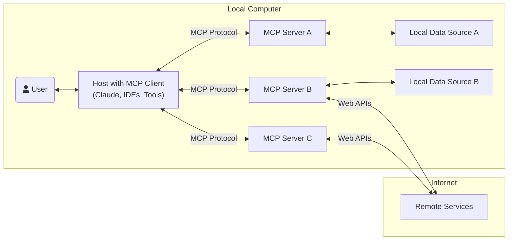
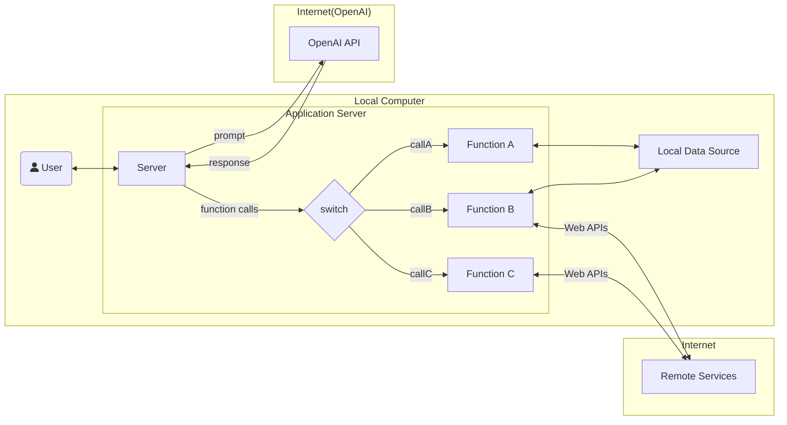

<link
  href="https://cdnjs.cloudflare.com/ajax/libs/font-awesome/6.5.1/css/all.min.css"
  rel="stylesheet"
/>

# My MCP Example

## MCP(Model Context Protocol)

MCPは、アプリケーションがLLMにコンテキストを提供する方法を標準化したオープンプロトコルである。これはAIアプリケーション用のUSB-Cポートのようなもので、AIモデルと様々なデータソースやツールを標準的な方法で接続することを可能にする。



参考: https://modelcontextprotocol.io/introduction

### 【類似概念】 Function Calling



参考: https://platform.openai.com/docs/guides/function-calling


## Getting Started (Claude Desktopを用いた方法)

### 1. Claude Desktopをダウンロードする

https://claude.ai/download

### 2. Custom MCPサーバーをビルドする

```sh
$ npm install
$ npm run build

# main.cjsのフルパスを表示する
$ find $(pwd)/apps -type f -name "main.cjs"
```

### 3. Claude Desktopの設定でMCPサーバーを登録する

> [!NOTE]
> 以下は、macOS版でのやり方です。その他のOSについては[公式ドキュメント](https://modelcontextprotocol.io/quickstart/server#:~:text=Testing%20your%20server%20with%20Claude%20for%20Desktop)を参照してください。

```sh
$ vi ~/Library/Application\ Support/Claude/claude_desktop_config.json
```

```json
{
  "mcpServers": {
    "weather": {
      // NOTE: nodeのフルパスを指定（`$ which node`）
      "command": "node",
      // NOTE: main.cjsのフルパスを指定
      "args": ["xxx/dist/main.cjs"]
    },
    // ...
  }
}
```

### 4. Claude DesktopでMCPサーバーが登録されていることを確認する

Claude Desktopを再起動し、MCPサーバーが登録されていることを確認する


試しにサンフランシスコの天気を聞くと、MCPサーバーから天気予報の情報を取得し、生成AIのメッセージに天気の情報が組み込まれていることがわかる。


（参考）MCPサーバーがない場合


## 参考リンク

- https://www.anthropic.com/news/model-context-protocol
- https://modelcontextprotocol.io/quickstart/server
