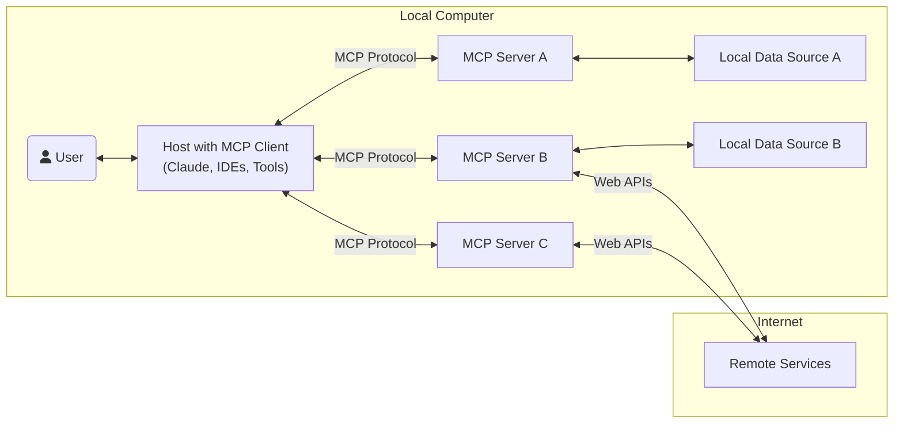
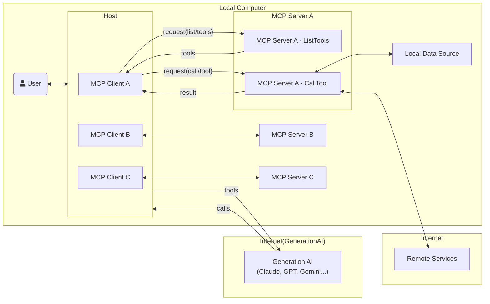
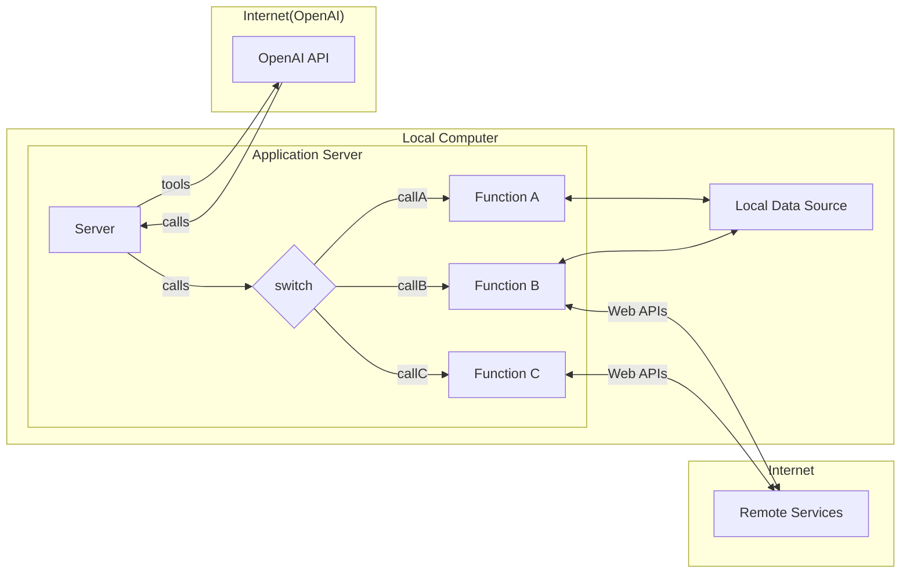

<link
  href="https://cdnjs.cloudflare.com/ajax/libs/font-awesome/6.5.1/css/all.min.css"
  rel="stylesheet"
/>

# My MCP Example

|name|description|
|---|---|
|[openai-mcp-host](./apps/openai-mcp-host/)|OpenAIを用いたMCPホスト|
|[weather-server](./apps/weather-server/)|天気を取得するMCPサーバー|

※ サードパーティ製のMCPサーバー集: https://github.com/modelcontextprotocol/servers

## Getting Started

```sh
$ npm install
$ npm run build
```

初めての方は、まず[weather-server](./apps/weather-server/README.md)を動かしてみることをおすすめする。

## MCP(Model Context Protocol)

MCPは、アプリケーションがLLMにコンテキストを提供する方法を標準化したオープンプロトコルである。これはAIアプリケーション用のUSB-Cポートのようなもので、AIモデルと様々なデータソースやツールを標準的な方法で接続することを可能にする。



参考: https://modelcontextprotocol.io/introduction


実際は、Claude DesktopのようなMCPホストの裏側では、Function Callingを駆使しつつ、MCPクライアントとMCPサーバー間をやりとりしているに過ぎない。Function Callingのプロトコルを管理するMCPクライアントと実際の外部処理を行うMCPサーバーで責務を分けることがMCPの考えにおいて肝となる。基本的にはMCPクライアントとMCPサーバーは1対1の関係となり、MCPホストが複数のMCPクライアントを束ねる形を取る。

下記の図でいうと、tool一覧を取得したり（`request(list/tools)`）、toolからサーバーの関数を実行する（`request(call/tool)`）部分がMCPであると言える。



### 【補足】 Function Calling



参考: https://platform.openai.com/docs/guides/function-calling

## 参考リンク

- https://www.anthropic.com/news/model-context-protocol
- https://modelcontextprotocol.io/quickstart/server
- https://github.com/modelcontextprotocol/typescript-sdk
- https://github.com/modelcontextprotocol/servers?tab=readme-ov-file
