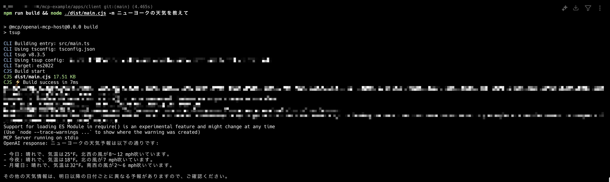
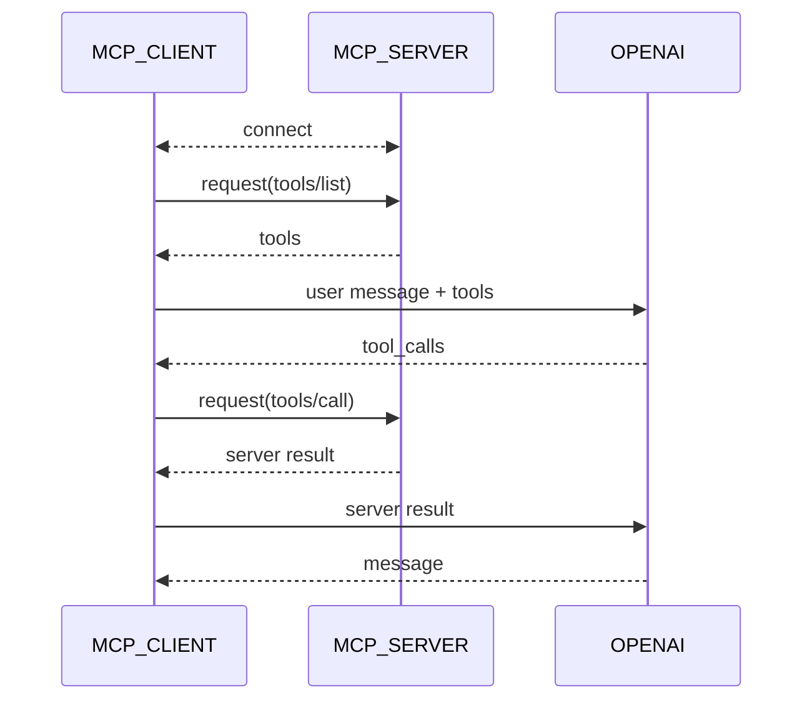

# OpenAI MCP Host

OpenAIのGPTモデルを用いたMCPホスト

## Getting Started

### 1. OPEN AIのAPI KEYを発行する

https://platform.openai.com/settings/organization/api-keys

### 2. .envを作成する

.envを作成し、必要な環境変数を登録する

```sh
cp .env.example .env
```

### 3. ビルドする

```sh
$ npm run build
$ node ./dist/main.cjs -m ニューヨークの天気を教えて
```



## Architecture



## 参考リンク

- https://modelcontextprotocol.io/quickstart/client
